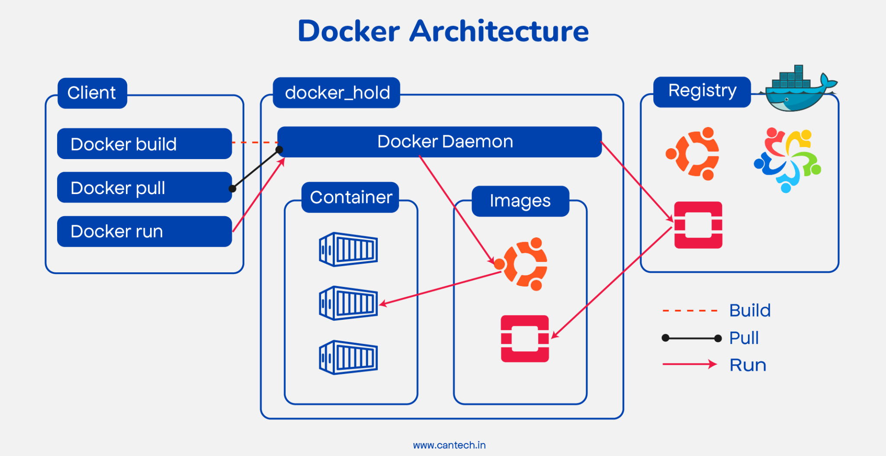

# 🐳 Docker – Theoretical Foundations & Architecture Notes

## 1. Why Docker Exists (Problem Statement)

### ❌ Traditional Deployment Problems
- “Works on my machine” issue
- Dependency conflicts (Node v14 vs v18)
- OS mismatch (Windows vs Linux)
- Heavy Virtual Machines
- Slow startup time
- Poor scalability

💡 **Solution: Containerization**
Docker solves this by:
- Packaging application + dependencies together
- Isolating runtime environments
- Making applications portable
- Reducing infrastructure overhead

## 2. Virtual Machines vs Containers ⚖️

### 🖥 Virtual Machine Architecture
```
Hardware
   ↓
Host OS
   ↓
Hypervisor
   ↓
Guest OS
   ↓
App + Dependencies
```
Each VM:
- Has its own OS
- Heavy (GBs in size)
- Slow boot time
- High memory usage

### 🐳 Container Architecture
```
Hardware
   ↓
Host OS
   ↓
Docker Engine
   ↓
Containers
   ↓
App + Dependencies
```
Containers:
- Share host OS kernel
- Lightweight (MBs)
- Fast startup
- Efficient resource usage

🔥 This is why containers dominate cloud-native systems.


## 3. What is Docker Actually? (Technical View)

Docker is:
> A platform that uses OS-level virtualization to deliver software in packages called containers.

It uses:
- Linux namespaces
- cgroups (control groups)
- Union file systems

Even on Windows/Mac, Docker runs a lightweight Linux VM in background.

## 4. Docker Architecture 🏗

This is very important for interviews.

### Main Components:
1. **Docker Client**  
   - CLI tool (`docker` command)
   - Sends commands to Docker Daemon

2. **Docker Daemon (`dockerd`)**  
   - Background service
   - Builds images
   - Runs containers
   - Manages networks & volumes

3. **Docker REST API**  
   - Communication layer between client and daemon

4. **Docker Objects**  
   Docker works with:
   - Images
   - Containers
   - Networks
   - Volumes

📌 **Architecture Flow**  
User → Docker CLI → Docker Daemon → Container Runtime → Containers



## 5. Docker Images (Deep Understanding) 📦

An image is:
> A read-only template used to create containers.

### Important Concepts:
#### 🔹 Layered Architecture
Each image consists of layers.

Example:
- Base OS Layer
- Node Layer
- App Dependencies Layer
- App Code Layer

**Benefits:**
- Faster builds
- Layer caching
- Reusability
- Smaller downloads (only changed layers)

#### 🔹 Union File System
Docker uses:
- OverlayFS (Linux)

Allows layers to stack.
Containers add a writable layer on top.

## 6. Container Lifecycle 🔄

States:
- Created
- Running
- Paused
- Stopped
- Deleted

Containers are ephemeral by design → if removed, data is gone (unless volumes used).

## 7. Docker Networking 🌐

By default Docker creates:
- `bridge` network
- `host` network
- `none` network

**Bridge (most common):**
Containers communicate internally.

Example: App Container → Mongo Container

Docker provides:
- Internal DNS
- Container name resolution

## 8. Docker Volumes 💾

**Problem:** Containers are temporary.  
**Solution:** Volumes store persistent data.

**Types:**
- Named volumes
- Bind mounts
- tmpfs

Used for:
- Databases
- Logs
- Uploaded files

## 9. Docker Registry 🏬

A registry stores images.

**Public:** Docker Hub  
**Private:** AWS ECR, GitHub Container Registry

**Flow:** Build → Tag → Push → Pull → Run

## 🔟 Containerization in Cloud Architecture ☁️

Modern cloud systems use:
- Microservices
- Stateless applications
- CI/CD pipelines
- Auto scaling

Docker enables:
- Immutable infrastructure
- Faster deployments
- Horizontal scaling
- Better DevOps workflows

## 1️⃣1️⃣ Security Model 🔐

Important theoretical points:
- Containers share kernel (not as isolated as VMs)
- Use minimal base images (Alpine)
- Avoid running as root
- Use image scanning tools

## 1️⃣2️⃣ When NOT to Use Docker ❌

- Heavy monolithic legacy apps
- GUI-heavy desktop apps
- Kernel-level software